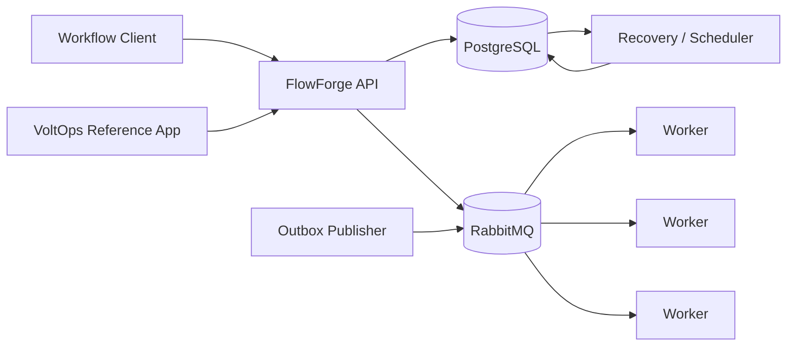

# Initial Architecture Proposal

## Context

## Components

- API layer: accepts workflow commands and exposes read operations.
- Workflow coordinator: validates DAGs, evaluates dependencies, and advances durable state.
- Task store: owns transactional task state changes and concurrency-sensitive claims.
- Worker registry: stores worker identity, capabilities, heartbeat, and availability.
- Lease manager: represents task ownership, expiry, and fencing tokens.
- Retry manager: applies retry policy and dead-letter transitions.
- Outbox publisher: publishes durable events after database commit.
- Recovery component: finds unfinished or expired work after restart.
- Workers: poll or receive eligible tasks, execute handlers, heartbeat, and submit fenced results.

## Durable-state strategy

PostgreSQL is the source of truth for workflows, tasks, workers, leases, idempotency records, and outbox messages. State transitions and creation of their corresponding outbox record occur in one database transaction.

## Worker communication

The initial design uses polling for task acquisition. Workers ask for work matching their declared capabilities. Claims are performed atomically in the database. This reduces broker-specific coordination complexity and makes lease recovery explicit.

## Event delivery

State changes create outbox records in the same transaction as the business state change. A publisher reads unsent records and publishes to RabbitMQ. Publication is at least once. Consumers must therefore be idempotent.

## Concurrency model

A task claim selects an eligible task and records worker identity, lease expiry, and a fencing token in one atomic transaction. Only the current owner with the current token may commit a result.

## Recovery

On restart, the orchestrator reconstructs state from PostgreSQL. Expired leases make tasks eligible for reassignment. Completed tasks remain terminal and are not rerun.

## Why modular monolith first

The first implementation keeps orchestration components in one deployable application while separating FlowForge and VoltOps into Maven modules. This keeps transactions and debugging straightforward. Service boundaries can be introduced later from observed operational needs.
