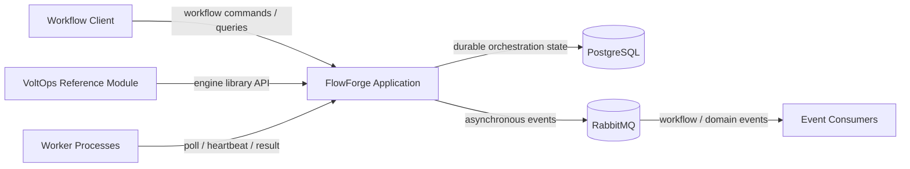
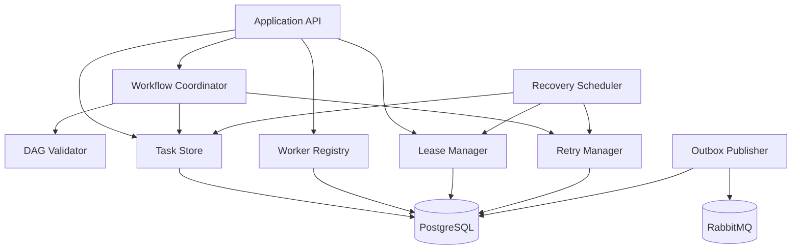
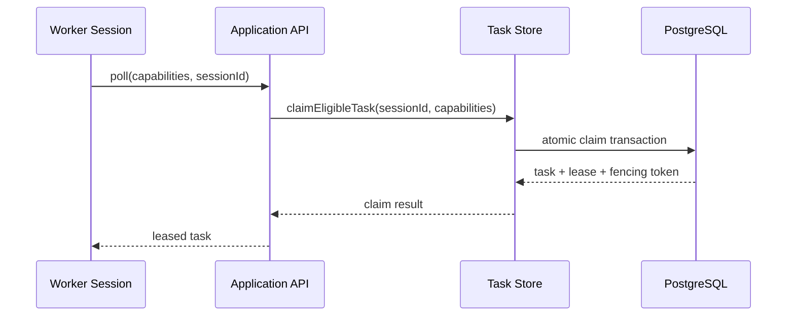
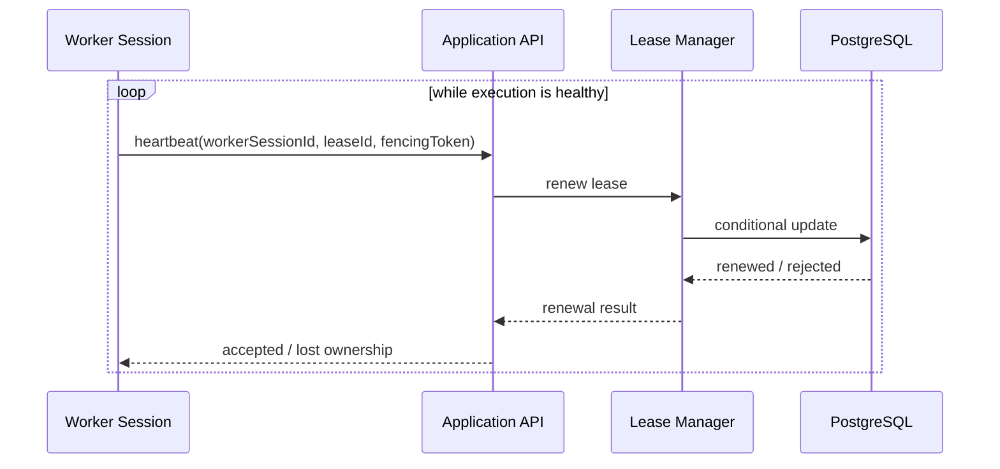
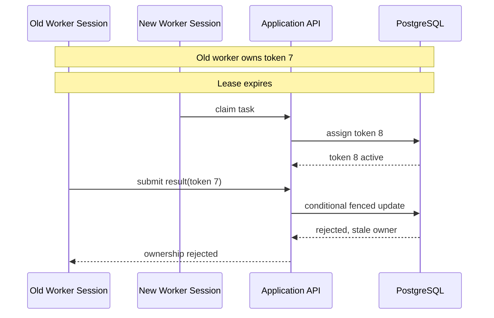
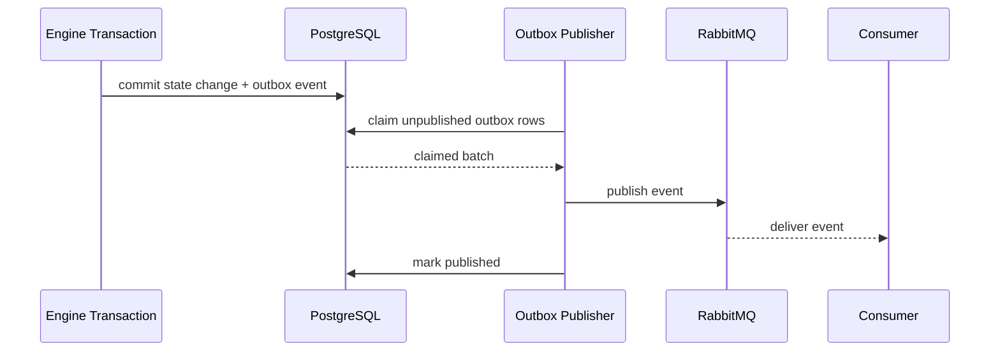
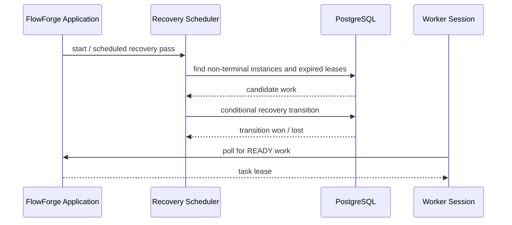

# Initial Architecture Proposal

## 1. Design goals

FlowForge is a domain-independent workflow orchestration engine for long-running workflows composed of dependent tasks. The architecture prioritizes durable state, safe concurrent ownership, recovery after process failure, duplicate-safe delivery, and clear separation between orchestration semantics and domain-specific business logic.

The preferred Week 1 deployment model is a modular monolith with three Maven modules:

```text
flowforge-engine       reusable orchestration library
voltops-reference      domain library / adapter
flowforge-application  sole executable Spring Boot application
```

The application module is the only deployable process in the initial design. Workers are separate runtime processes that communicate with the application API. VoltOps provides domain workflow definitions and adapters rather than a second executable Spring Boot service.

## 2. System-context diagram



System boundary:

- FlowForge owns orchestration semantics and durable coordination.
- VoltOps owns electrical-maintenance business rules and uses FlowForge abstractions.
- Workers execute domain handlers. Workers do not own authoritative workflow state.
- PostgreSQL is the durable source of truth for engine-controlled state.
- RabbitMQ carries asynchronous workflow and domain events only. RabbitMQ delivery does not grant task ownership.

## 3. Component diagram



## 4. Component responsibilities

- Application API: accepts workflow commands, worker polls, heartbeats, result submissions, and read operations. It does not treat RabbitMQ as the ownership authority.
- Workflow coordinator: validates workflow definitions, creates instances from immutable versions, evaluates dependencies, and advances durable workflow state.
- DAG validator: rejects missing dependencies, duplicate task keys, self-dependencies, and dependency cycles before an instance becomes executable.
- Task store: performs durable task reads and concurrency-sensitive state transitions. Task claims are atomic database operations.
- Worker registry: records a permanent logical worker identity plus a separate session identity for each process session, capability declarations, heartbeat information, and session status.
- Lease manager: creates and renews time-bounded task ownership and records fencing generations. Expiry determines eligibility for recovery. Ownership is not granted by broker delivery.
- Retry manager: records attempt outcomes, applies immutable retry policy versions, computes backoff, and moves exhausted tasks to dead-letter state.
- Recovery scheduler: finds expired or unfinished work and performs idempotent recovery transitions. Multiple schedulers may run concurrently, but only one valid transition may succeed for a given task generation.
- Outbox publisher: claims durable outbox records for publication and sends asynchronous events to RabbitMQ. It does not decide task ownership.
- Workers: poll for compatible work, execute handlers, send progress heartbeats, and submit results with session and lease ownership metadata.

## 5. Durable-state strategy

PostgreSQL is the source of truth for workflow definitions, workflow instances, task definitions, task instances, attempts, worker sessions, leases, retry metadata, idempotency records, and outbox messages.

Critical engine-owned transitions are transactional:

1. Claiming a task records the task instance ownership, lease generation, session identity, and lease expiry as one atomic transition.
2. A valid task result, attempt outcome, task state change, workflow state change, and corresponding outbox event commit together when they belong to the engine's database transaction.
3. An engine-owned idempotency record and the corresponding engine-owned business state change commit together when the protected state is in the same database.

External systems are not part of the PostgreSQL transaction. Their integrations require their own idempotency, reconciliation, or compensation contract.

## 6. Worker communication model

Task acquisition uses capability-based API polling.

A worker session sends a poll request containing its session identity and capabilities. The application selects an eligible READY task and performs an atomic database claim. The response grants an explicit task lease. RabbitMQ is not involved in granting ownership.

A worker sends periodic heartbeats while the lease is active. The worker session identity is unique to the process session and is expected to change after process restart.

Result submission contains:

```text
workflow_instance_id
task_instance_id
worker_id
worker_session_id
lease_id
fencing_token
attempt_id
execution outcome
```

The engine accepts the result only when the identity, lease, token, current task state, and lease validity all match the current durable ownership record.

## 7. Sequence: task claim



Exactly one concurrent claim wins for a given task instance.

## 8. Sequence: heartbeat and lease renewal



A stale session cannot renew a lease after ownership has moved to a newer fencing generation.

## 9. Sequence: zombie-worker rejection



Fencing protects engine-controlled writes. It does not automatically undo an external side effect performed before the stale worker loses ownership.

## 10. Sequence: outbox publication



If the publisher crashes after RabbitMQ accepts the message but before `published_at` is recorded, the event is published again. Consumers must therefore be idempotent.

Multiple publishers use a database claim/lease mechanism so only one publisher owns a record at a time. Duplicate publication remains possible after the publish-before-mark window.

## 11. Sequence: orchestrator-restart recovery



Recovery must not steal work protected by an unexpired lease. Competing recovery schedulers use conditional state transitions so only one recovery generation becomes authoritative.

## 12. Event-delivery strategy

FlowForge separates durable state from asynchronous publication.

```text
Engine state transition
        |
        v
PostgreSQL transaction
   |              |
   |              +--> OutboxEvent
   +--> workflow/task state
        |
      commit
        |
        v
Outbox publisher
        |
        v
RabbitMQ
```

RabbitMQ is used for asynchronous workflow and domain events. It is not a task ownership mechanism.

Broker redelivery and FlowForge task retry are separate concepts:

- Broker redelivery means the same published message reaches a consumer again.
- Task retry means an execution attempt ended without a successful task result and the retry policy schedules another attempt.

A broker duplicate must not itself increment the task attempt count.

## 13. Recovery and concurrency

Recovery is driven by durable state rather than in-memory execution context.

For an expired task, the recovery operation checks the current state and lease generation before changing ownership or scheduling a new attempt. A second scheduler that sees the same expired task loses the conditional update and performs no second transition.

The architecture therefore assumes multiple recovery schedulers are possible and makes the database transition, rather than scheduler coordination in memory, the authority.

## 14. Deployment model

Initial deployment:

```text
flowforge-application  --> PostgreSQL
                       --> RabbitMQ

worker-1  -------------> flowforge-application
worker-2  -------------> flowforge-application
worker-3  -------------> flowforge-application
```

Maven modules:

```text
flowforge-engine       reusable library
voltops-reference      domain library / adapter
flowforge-application  executable Spring Boot application
```

Only `flowforge-application` owns the `main` Spring Boot entry point. The reusable engine module must remain free of deployment-specific application startup.

## 15. Key invariants

- A task has at most one authoritative current owner.
- A worker session identity identifies one process session and is not treated as a permanent ownership identity.
- A lease has an explicit expiry time.
- Fencing generations strictly increase when task ownership changes.
- Result acceptance requires task ID, worker session ID, lease ID, fencing token, current task state, and valid lease ownership to match.
- An expired lease does not authorize the old worker to continue renewing or committing results.
- Recovery never steals an unexpired lease.
- Terminal tasks are not rerun solely because the application restarted.
- A required predecessor must satisfy the workflow's dependency-success rule before a dependent task becomes READY.
- A committed engine state change that requires an event has a corresponding durable outbox record.
- RabbitMQ publication does not grant or change task ownership.
- Repeated delivery with the same logical idempotency identity does not apply the protected logical operation twice.
- Workflow definitions and retry policies referenced by running instances are immutable versions.
