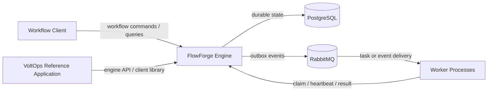
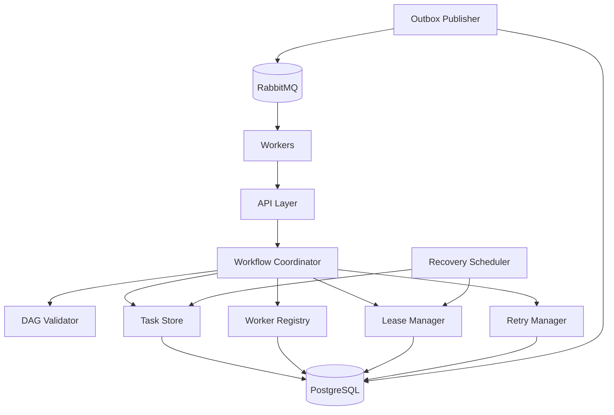

# Initial Architecture Proposal

## 1. Design goals

FlowForge is a domain-independent workflow orchestration engine for long-running workflows composed of dependent tasks. The architecture prioritizes durable state, safe concurrent ownership, recovery after process failure, duplicate-safe delivery, and clear separation between orchestration semantics and domain-specific business logic.

The Week 1 architecture intentionally uses a modular monolith. FlowForge and VoltOps remain separate Maven modules, while orchestration components share one deployable application and one PostgreSQL consistency boundary.

## 2. System context



System boundary:

- FlowForge owns orchestration semantics and durable coordination.
- VoltOps owns electrical-maintenance business rules and uses FlowForge as a client/library.
- Workers execute domain handlers and never become the source of truth for workflow state.
- PostgreSQL is the durable source of truth.
- RabbitMQ transports work and events but does not define authoritative task ownership.

## 3. Component view



## 4. Component responsibilities

- API layer: accepts workflow commands, worker requests, heartbeats, results, and read operations. It does not contain persistence coordination rules.
- Workflow coordinator: validates workflow definitions, evaluates dependencies, creates task state, and advances workflow state from durable facts.
- DAG validator: rejects malformed workflows, including missing dependencies, duplicate task keys, and dependency cycles, before execution begins.
- Task store: performs durable task reads and concurrency-sensitive state transitions. Claims are atomic.
- Worker registry: records worker identity, declared capabilities, heartbeat time, and availability.
- Lease manager: creates and renews task ownership leases, assigns monotonically increasing fencing tokens, and determines when ownership expires.
- Retry manager: applies retry policy, calculates eligibility, records attempts, and moves exhausted tasks to dead-letter state.
- Recovery scheduler: finds unfinished or expired work after restart and during normal operation, then returns eligible work to READY without rerunning terminal tasks.
- Outbox publisher: publishes durable outbox records to RabbitMQ after the database transaction commits. Publication is at least once.
- Workers: request compatible work, execute handlers, renew leases, and submit results with the ownership token supplied by the engine.

## 5. Durable-state strategy

PostgreSQL is the source of truth for workflow definitions, workflow instances, tasks, dependencies, worker registrations, leases, retry metadata, idempotency records, and outbox messages.

Critical transitions are performed transactionally:

1. Task claim updates task ownership, lease expiry, and fencing token together.
2. A fenced task result and its corresponding outbox event are committed together.
3. Idempotency-key creation and the protected business-state change share one transaction when both are in the same database.

The broker is therefore a delivery mechanism, not the authoritative record of workflow progress.

## 6. Worker communication model

The initial design uses capability-based polling.

A worker sends its worker identity and declared capability set when requesting work. The engine selects an eligible READY task whose required capability is satisfied, atomically records ownership, creates or updates the lease, and assigns a new fencing token.

Workers heartbeat before lease expiry. A worker whose lease expires loses authority even if its process continues running.

Result submission must include:

- task identity
- worker identity
- fencing token
- execution outcome
- idempotency information where required

The engine accepts the result only when the submitted ownership information still matches current durable ownership.

## 7. Event-delivery strategy

The transactional outbox pattern separates database commit from broker availability.

```text
State transition
      |
      v
PostgreSQL transaction
  |             |
  |             +--> Outbox record
  |
  +--> Durable task/workflow state

             commit
                |
                v
        Outbox Publisher
                |
                v
             RabbitMQ
```

A broker outage therefore does not lose a committed event. Unpublished records remain durable and are retried later. Duplicate publication is acceptable. Consumers must process events idempotently.

## 8. Concurrency model

Two or more workers are allowed to request the same class of work concurrently. Exactly one claim wins through an atomic database operation.

The winning claim records:

```text
worker_id
lease_id
lease_expiry
fencing_token
```

Every later ownership-sensitive update checks the current fencing token. After reassignment, an old worker has a lower token and its result is rejected.

This prevents a stale worker from overwriting the outcome of the current owner.

## 9. Recovery model

Recovery is driven by durable state rather than in-memory execution context.

After an orchestrator restart:

1. Read unfinished workflows and non-terminal tasks from PostgreSQL.
2. Identify expired leases and recover eligible tasks.
3. Leave terminal tasks untouched.
4. Allow healthy workers to reclaim READY tasks.
5. Continue publishing unsent outbox records.

A task already marked SUCCEEDED is never rerun solely because the orchestrator restarted.

## 10. Why modular monolith first

The first implementation keeps orchestration components in one deployable application while keeping FlowForge and VoltOps in separate Maven modules.

Benefits:

- one transactional database boundary
- simpler local development
- easier debugging of concurrency behavior
- fewer distributed deployment concerns during validation
- clear module-level domain separation

Microservice boundaries remain a later optimization based on measured scaling, ownership, or operational requirements.

## 11. Key invariants

The design must preserve these invariants:

- A task has at most one current owner.
- A lease has an explicit expiry time.
- Fencing tokens strictly increase whenever ownership changes.
- A stale fencing token cannot commit a result.
- Terminal tasks are not rerun during recovery.
- A committed database state change has a corresponding durable outbox record.
- Repeated delivery with the same logical idempotency key does not apply the protected business operation twice.
- A workflow cannot execute a dependency before its predecessors satisfy the required terminal-success condition.
