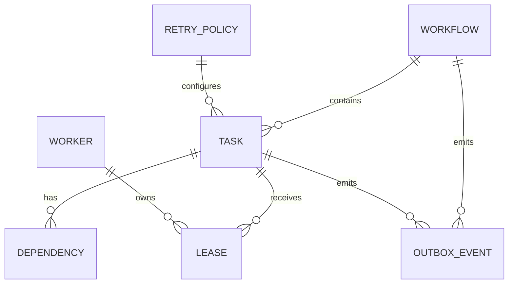

# Initial Data Model Proposal

## 1. Modeling goals

The data model must keep workflow state durable, support safe concurrent task claiming, represent ownership expiry, reject stale workers, support retries and idempotency, and preserve committed events through broker failures.

PostgreSQL is the consistency boundary for all orchestration state.

## 2. Entities

### Workflow

```text
workflow_id       PK
workflow_key      business identifier for a workflow definition
version           definition version
status            lifecycle state
created_at
completed_at
```

Constraint: `UNIQUE(workflow_key, version)`.

### Task

```text
task_id             PK
workflow_id         FK -> workflow.workflow_id
task_key            unique within workflow
state
retry_policy_id     FK -> retry_policy.retry_policy_id
next_eligible_at
current_lease_id    FK -> lease.lease_id, nullable
result_ref          nullable
error_code          nullable
attempt_count
created_at
updated_at
```

Constraint: `UNIQUE(workflow_id, task_key)`.

### Dependency

```text
task_id               FK -> task.task_id
depends_on_task_id    FK -> task.task_id
```

Primary key: `(task_id, depends_on_task_id)`.

Constraint: `task_id <> depends_on_task_id`.

Workflow definition validation must also reject dependency cycles before the workflow is accepted for execution.

### Worker

```text
worker_id             PK
capabilities          declared capability set
status                worker availability
last_heartbeat_at
total_claims
created_at
updated_at
```

Index by `status` and heartbeat time for liveness checks.

### Lease

```text
lease_id              PK
task_id               FK -> task.task_id
worker_id             FK -> worker.worker_id
expires_at
fencing_token
created_at
released_at           nullable
```

Important invariant: each task has at most one current active lease.

`fencing_token` is monotonically increasing for a task whenever ownership changes.

### IdempotencyRecord

```text
idempotency_key       PK
operation_type
request_hash
outcome_ref
created_at
```

Constraint: one logical request key maps to one protected outcome.

A conflicting request that reuses the same key with a different request hash must be rejected rather than treated as a duplicate of the original request.

### OutboxEvent

```text
event_id              PK
aggregate_type
aggregate_id
event_type
payload
created_at
published_at          nullable
attempts
last_error             nullable
```

Unpublished events are represented by `published_at IS NULL`.

### RetryPolicy

```text
retry_policy_id       PK
max_attempts
backoff_policy
timeout_seconds
```

## 3. Relationship model



The dependency relationship is self-referential on `TASK`: one task depends on another task in the same workflow.

## 4. Keys and constraints

| Table | Primary key | Important foreign keys | Important constraints |
|---|---|---|---|
| workflow | workflow_id | none | unique `(workflow_key, version)` |
| task | task_id | workflow_id, retry_policy_id, current_lease_id | unique `(workflow_id, task_key)` |
| dependency | `(task_id, depends_on_task_id)` | both columns reference task | no self-dependency |
| worker | worker_id | none | worker identity is stable during an execution session |
| lease | lease_id | task_id, worker_id | at most one active lease per task |
| idempotency_record | idempotency_key | none | unique logical request key |
| outbox_event | event_id | logical aggregate references | `published_at` remains null until publication succeeds |
| retry_policy | retry_policy_id | none | non-negative attempts and positive timeout |

## 5. Indexes

Recommended indexes:

```text
workflow(workflow_key, version)
task(state, next_eligible_at)
task(workflow_id, state)
task(current_lease_id)
dependency(depends_on_task_id)
worker(status, last_heartbeat_at)
lease(task_id, expires_at)
lease(expires_at)
outbox_event(published_at, created_at)
idempotency_record(created_at)
```

The highest-value scheduling index is the task index on `(state, next_eligible_at)` because recovery and worker polling repeatedly search for eligible work.

## 6. Transaction boundaries

### Task claim

One database transaction must:

1. identify an eligible task
2. verify it is still claimable
3. create or replace the active ownership record
4. assign the next fencing token
5. persist the owner and lease expiry

Concurrent workers therefore observe one winner.

### Lease renewal

Renewal must update the lease only when the worker identity and current fencing token still match. A stale worker must not extend a lease after reassignment.

### Task result

One transaction must:

1. verify task identity
2. verify worker identity
3. verify current fencing token
4. apply the task result
5. update workflow/task state as needed
6. insert the corresponding outbox event

If any step fails, the transaction rolls back.

### Idempotent operation

When the protected business state lives in the same database:

1. check or insert the idempotency record
2. apply the business state change
3. store the resulting outcome reference

These operations commit atomically.

When an external system is involved, it is outside the database transaction. The integration must use an idempotency key, transactional inbox/outbox where appropriate, or a compensating action.

## 7. Concurrency and fencing invariant

For task `T`, ownership generations look like:

```text
Worker A claims T -> fencing_token = 7
Worker A lease expires
Worker B claims T -> fencing_token = 8
```

Any result carrying token `7` is stale after token `8` is committed and must be rejected.

The database is authoritative for the current token. Worker-local state never overrides the durable token.

## 8. Retention considerations

Idempotency records and outbox events require a retention policy. Cleanup must not remove records while they are still needed to deduplicate active requests or reconstruct required event-delivery history. Exact retention duration is an implementation decision for a later stage.
