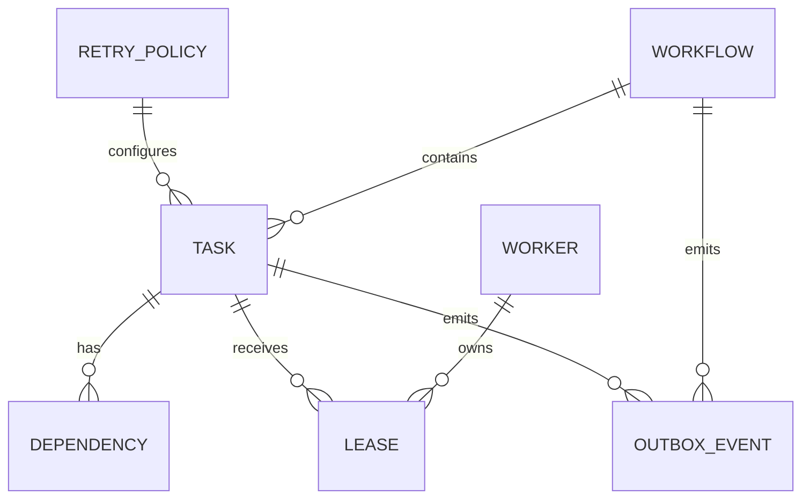

# Initial Data Model Proposal

## Entities

- Workflow: workflow_id, workflow_key, version, status, created_at, completed_at.
- Task: task_id, workflow_id, task_key, state, retry_policy_id, lease_id, result_ref, error_code.
- Dependency: task_id, depends_on_task_id. Together with workflow_id, enforce uniqueness.
- Worker: worker_id, capabilities, status, last_heartbeat_at.
- Lease: lease_id, task_id, worker_id, expires_at, fencing_token.
- IdempotencyRecord: idempotency_key, operation_type, request_hash, outcome_ref, created_at.
- OutboxEvent: event_id, aggregate_type, aggregate_id, event_type, payload, published_at, attempts.
- RetryPolicy: retry_policy_id, max_attempts, backoff_policy, timeout_seconds.

## Relationships

## Keys and constraints

Workflow uses a surrogate primary key plus a unique workflow key/version pair. Task uses task_id and a unique workflow_id/task_key pair. Dependency has a composite key and must reject self-dependencies. Lease uses lease_id and a unique active lease per task. IdempotencyRecord uses idempotency_key as a unique key.

Fencing tokens are monotonically increasing values associated with task ownership. A result update must match the current lease and fencing token.

## Indexes

Index Task by state and next eligible time for scheduling. Index Task by workflow_id and state. Index Worker by status. Index Lease by expires_at. Index OutboxEvent by published_at and created_at. Index IdempotencyRecord by created_at for retention work.

## Transaction boundaries

A task claim, ownership metadata, and fencing-token increment occur in one transaction. A task result and its corresponding outbox event occur in one transaction. Idempotency-record creation and the protected business state change occur in one transaction where the business operation shares the database.

External side effects remain outside the database transaction and must use idempotency or a compensating strategy.
