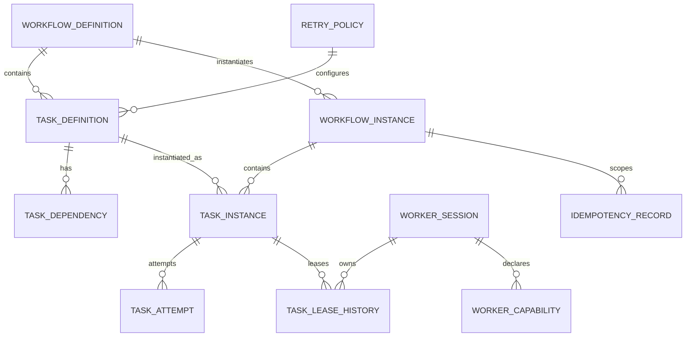

# Initial Data Model Proposal

## 1. Modeling goals

The data model must preserve the distinction between what a workflow is and an execution of that workflow, between what a task is and one execution attempt, and between current ownership state and historical ownership records.

The model must support:

- immutable workflow and task definitions
- multiple workflow instances per definition version
- multiple task instances per task definition
- dependency-aware scheduling
- worker sessions that change across process restarts
- historical leases and task attempts
- authoritative fencing generation on the task instance
- retry and timeout history
- scoped idempotency
- durable outbox publication

PostgreSQL is the orchestration consistency boundary.

## 2. Target entity set

```text
workflow_definition
task_definition
task_dependency
workflow_instance
task_instance
task_attempt
worker_session
worker_capability
task_lease_history
retry_policy
idempotency_record
outbox_event
```

## 3. Entity definitions

### workflow_definition

```text
workflow_definition_id       PK
workflow_key                logical workflow name
version                     immutable version number
status                      definition lifecycle
definition_payload          serialized definition
created_at
```

Constraints:

```text
UNIQUE(workflow_key, version)
A referenced version is immutable.
```

A workflow instance references exactly one immutable workflow-definition version.

### task_definition

```text
task_definition_id          PK
workflow_definition_id       FK -> workflow_definition
task_key
required_capability
retry_policy_id              FK -> retry_policy
metadata
```

Constraint:

```text
UNIQUE(workflow_definition_id, task_key)
```

A task definition describes a unit of work inside a workflow definition. It does not represent one execution.

### task_dependency

```text
task_definition_id            FK -> task_definition
depends_on_task_definition_id FK -> task_definition
```

Primary key:

```text
(task_definition_id, depends_on_task_definition_id)
```

Constraints:

```text
task_definition_id <> depends_on_task_definition_id
Both task definitions belong to the same workflow definition.
Cycles are rejected during definition validation.
```

Dependencies belong to the definition graph, not individual executions. Instances inherit the validated graph from the immutable definition version.

### workflow_instance

```text
workflow_instance_id         PK
workflow_definition_id       FK -> workflow_definition
status
idempotency_scope / request reference
created_at
started_at                   nullable
completed_at                 nullable
```

Constraint:

```text
workflow_definition_id cannot be changed after instance creation.
```

One workflow definition version can have many workflow instances.

### task_instance

```text
task_instance_id             PK
workflow_instance_id         FK -> workflow_instance
task_definition_id           FK -> task_definition
state
authoritative_fencing_generation
next_eligible_at
result_ref                   nullable
error_code                   nullable
created_at
updated_at
```

Constraints:

```text
UNIQUE(workflow_instance_id, task_definition_id)
authoritative_fencing_generation is monotonic per task instance.
The task instance owns the authoritative current fencing generation.
```

The current active lease is derived from `task_lease_history` rather than stored as a foreign key on `task_instance`. This avoids a circular ownership reference between task and lease.

### task_attempt

```text
task_attempt_id              PK
task_instance_id             FK -> task_instance
attempt_number
outcome                      SUCCEEDED / FAILED / TIMED_OUT / LEASE_LOST
worker_session_id            FK -> worker_session, nullable
fencing_generation
started_at                   nullable
ended_at                     nullable
error_code                   nullable
error_details                nullable
```

Constraint:

```text
UNIQUE(task_instance_id, attempt_number)
```

Every execution attempt gets a durable history row. An attempt outcome is historical data, not a resting task state.

### worker_session

```text
worker_session_id            PK
worker_id                    logical worker identity
session_status
registered_at
last_heartbeat_at
expires_at                   nullable
```

A logical worker identity may have many sessions over time. A process restart creates a new `worker_session_id`.

### worker_capability

```text
worker_session_id            FK -> worker_session
capability_key
created_at
```

Primary key:

```text
(worker_session_id, capability_key)
```

Capabilities describe what the current worker session is eligible to execute.

### task_lease_history

```text
lease_id                     PK
task_instance_id             FK -> task_instance
worker_session_id            FK -> worker_session
fencing_generation
acquired_at
expires_at
released_at                  nullable
release_reason               nullable
```

A lease is historical. The row is never overwritten to represent a later owner.

Constraints:

```text
At most one unexpired active lease exists for a task instance.
A fencing_generation is unique per task instance ownership generation.
```

The current lease is derived by querying the active lease-history row for the task instance. Task ownership is therefore represented in one direction only: lease history references the task instance.

### retry_policy

```text
retry_policy_id              PK
version
max_attempts
backoff_type
backoff_parameters
timeout_seconds
created_at
```

Constraint:

```text
UNIQUE(retry_policy_id, version)
Referenced policy versions are immutable.
```

A running task instance continues using the policy version resolved by its immutable task definition.

### idempotency_record

```text
idempotency_record_id        PK
tenant_id / application_id    scope field
workflow_instance_id         nullable FK -> workflow_instance
operation_type
idempotency_key
request_hash
status
outcome_ref                  nullable
created_at
completed_at                 nullable
```

Effective uniqueness boundary:

```text
UNIQUE(tenant_id, application_id, operation_type, idempotency_key)
```

A repeated key with the same request hash maps to the existing logical operation. The same key with a different request hash is rejected as a conflict.

### outbox_event

```text
outbox_event_id              PK
aggregate_type
aggregate_id
event_type
payload
created_at
publish_attempts
publish_claim_id             nullable
publish_claim_expires_at     nullable
published_at                 nullable
last_error                   nullable
```

`published_at IS NULL` means the event still needs publication or verification of publication status.

## 4. Relationships



Dependency edges belong to task definitions. A workflow instance obtains the dependency graph by referencing its immutable workflow definition.

## 5. Keys and constraints

| Entity | Primary key | Important foreign keys | Important constraints |
|---|---|---|---|
| workflow_definition | workflow_definition_id | none | unique `(workflow_key, version)`, immutable after reference |
| task_definition | task_definition_id | workflow_definition_id, retry_policy_id | unique `(workflow_definition_id, task_key)` |
| task_dependency | `(task_definition_id, depends_on_task_definition_id)` | both → task_definition | no self-edge, same workflow definition |
| workflow_instance | workflow_instance_id | workflow_definition_id | definition reference immutable |
| task_instance | task_instance_id | workflow_instance_id, task_definition_id | unique pair, fencing generation owned here |
| task_attempt | task_attempt_id | task_instance_id, worker_session_id | unique `(task_instance_id, attempt_number)` |
| worker_session | worker_session_id | none | session identity changes across restarts |
| worker_capability | `(worker_session_id, capability_key)` | worker_session_id | no duplicate capability per session |
| task_lease_history | lease_id | task_instance_id, worker_session_id | at most one active lease per task |
| retry_policy | retry_policy_id + version | none | referenced versions immutable |
| idempotency_record | idempotency_record_id | optional workflow_instance_id | scoped uniqueness on logical request identity |
| outbox_event | outbox_event_id | logical aggregate ID | durable publication record |

## 6. Indexes

```text
workflow_definition(workflow_key, version)
task_definition(workflow_definition_id, task_key)
task_dependency(depends_on_task_definition_id)
workflow_instance(workflow_definition_id, status)
task_instance(state, next_eligible_at)
task_instance(workflow_instance_id, state)
task_attempt(task_instance_id, attempt_number)
worker_session(session_status, last_heartbeat_at)
worker_capability(capability_key, worker_session_id)
task_lease_history(task_instance_id, expires_at)
task_lease_history(expires_at)
idempotency_record(tenant_id, application_id, operation_type, idempotency_key)
outbox_event(published_at, created_at)
outbox_event(publish_claim_expires_at)
```

## 7. Transaction boundaries

### Definition publication

Create an immutable workflow definition version and its task definitions/dependencies in one transaction. Once an instance references the version, the definition is immutable.

### Workflow instantiation

Create the workflow instance and its task instances from one immutable definition version in one transaction.

### Task claim

One transaction must:

1. select an eligible task instance
2. verify current state and eligibility
3. verify the worker session and capability
4. read or lock the current active lease state
5. increment the task instance's authoritative fencing generation
6. create a new lease-history row
7. create the task attempt record

Concurrent claimers therefore produce one valid ownership generation.

### Lease renewal

Update the active lease only when the worker session, lease ID, and current fencing generation still match the task instance. A stale session cannot renew after reassignment.

### Task attempt outcome

One transaction records the attempt outcome and updates task/workflow state. A valid successful result also inserts the corresponding outbox event in the same transaction.

### Idempotent engine-owned operation

When the protected business state lives in the same PostgreSQL database:

1. insert or lock the scoped idempotency record
2. verify request-hash consistency
3. apply the protected state change
4. record the outcome

These steps commit atomically.

External systems are outside this transaction. Their operations require an integration-specific idempotency, reconciliation, or compensation strategy.

### Outbox publication

Multiple publishers claim unpublished rows using a conditional database claim with an expiry. Only the publisher holding the current claim should mark its publication attempt complete.

The publish-before-mark crash window still permits duplicate publication. Consumers must be idempotent.

## 8. Fencing invariant

Fencing authority lives on `task_instance`:

```text
Worker session S1 claims task T
    authoritative_fencing_generation = 7

Lease expires

Worker session S2 claims task T
    authoritative_fencing_generation = 8

S1 submits result with generation 7
    -> reject
```

The authoritative comparison uses task ID, worker session ID, lease ID, fencing generation, task state, and lease validity. The token alone is not sufficient.

## 9. Immutability rules

- Workflow definition versions are immutable after creation.
- Task definitions and dependency edges are immutable with their workflow definition version.
- Retry policies are immutable versions referenced by task definitions.
- Workflow instances keep their original definition version even when newer versions are published.
- Task attempts and lease history are append-only records.

## 10. Retention

Idempotency records, attempts, lease history, and outbox events require retention policies. Cleanup must not remove data still required for deduplication, reconciliation, audit, recovery diagnosis, or event replay requirements. Exact durations remain an implementation-stage decision.
