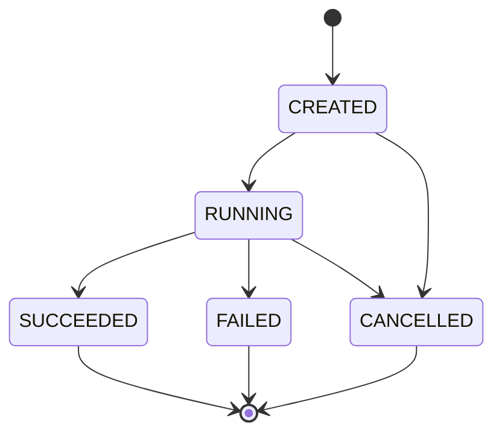
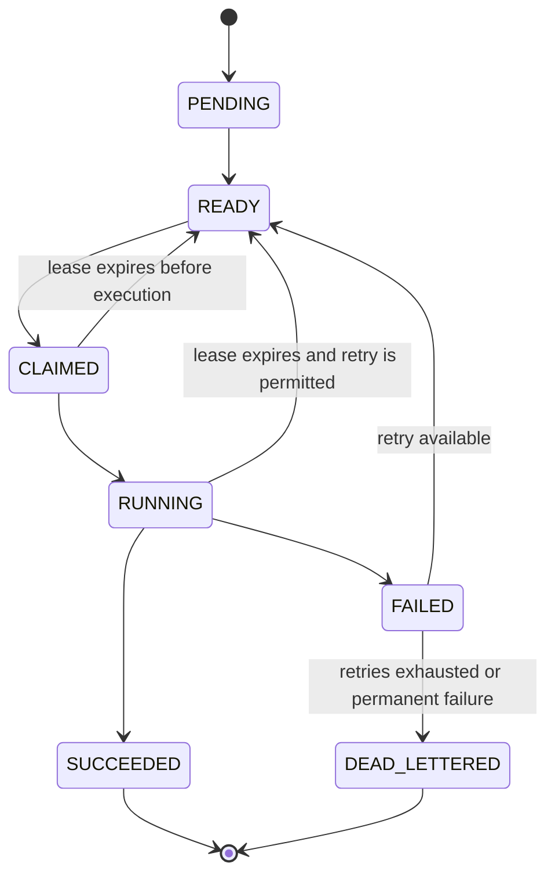

# Workflow and Task State Machine

## 1. State-machine principles

State transitions are driven by durable facts and explicit triggers. Workers cannot move tasks directly to terminal states without passing ownership and fencing validation.

The state model separates workflow lifecycle from task execution lifecycle. Task retries happen at task level. A workflow becomes FAILED when a task reaches a permanent failure state or when a workflow-level terminal condition is reached.

## 2. Workflow states



### Meaning

- `CREATED`: workflow instance exists and its definition has passed validation, but execution has not started.
- `RUNNING`: execution is active and one or more tasks remain non-terminal.
- `SUCCEEDED`: every required task completed successfully.
- `FAILED`: a permanent task failure or workflow-level terminal failure prevents completion.
- `CANCELLED`: execution was explicitly cancelled according to the supported cancellation policy.

### Workflow triggers

```text
CREATED -> RUNNING
  Trigger: successful start after validation

RUNNING -> SUCCEEDED
  Trigger: all required tasks are SUCCEEDED

RUNNING -> FAILED
  Trigger: a required task becomes DEAD_LETTERED or another defined permanent failure occurs

RUNNING -> CANCELLED
  Trigger: explicit cancellation accepted by workflow policy

CREATED -> CANCELLED
  Trigger: cancellation before execution begins
```

A failed workflow is terminal in the initial design. Retrying individual work is represented by task-level transitions rather than `FAILED -> RUNNING` at workflow level.

## 3. Task states



### Meaning

- `PENDING`: dependencies are not yet satisfied.
- `READY`: all required dependencies are in the required terminal-success state and the task is eligible for claiming.
- `CLAIMED`: a worker owns the task through a durable lease and fencing token, but execution has not yet been acknowledged as started.
- `RUNNING`: the current owner reports execution has started.
- `SUCCEEDED`: the current owner submitted a valid successful result and the engine committed it.
- `FAILED`: the latest execution attempt failed and the engine has not yet decided whether to retry.
- `DEAD_LETTERED`: the task reached a permanent failure condition or exhausted its retry policy.

## 4. Valid transitions

| From | To | Trigger |
|---|---|---|
| PENDING | READY | dependency evaluation confirms prerequisites succeeded |
| READY | CLAIMED | one worker wins an atomic claim |
| CLAIMED | RUNNING | accepted execution-start signal or equivalent engine transition |
| CLAIMED | READY | lease expires before execution and task remains retryable |
| RUNNING | SUCCEEDED | current owner submits a valid success result |
| RUNNING | FAILED | current owner submits a retryable or permanent failure |
| RUNNING | READY | lease expires and retry policy permits another attempt |
| FAILED | READY | retry policy has remaining attempts and backoff is satisfied |
| FAILED | DEAD_LETTERED | permanent failure or retry exhaustion |

## 5. Invalid transitions

The following are rejected:

```text
READY -> SUCCEEDED
READY -> DEAD_LETTERED without a valid engine decision
SUCCEEDED -> READY
SUCCEEDED -> RUNNING
DEAD_LETTERED -> READY
stale worker -> any ownership-sensitive result transition
worker without current lease -> RUNNING or SUCCEEDED
```

A stale result is rejected when the submitted worker identity or fencing token does not match current durable ownership.

## 6. Ownership and fencing

Every claimed task has current ownership metadata:

```text
worker_id
lease_id
expires_at
fencing_token
```

Example:

```text
Worker A claims task T
    fencing token = 7

Lease expires

Worker B reclaims task T
    fencing token = 8

Worker A returns with token 7
    -> reject as stale
```

The database comparison against the current fencing token is the authority. A worker cannot restore its own expired ownership by submitting a result.

## 7. Recovery transitions

After an orchestrator restart:

```text
CLAIMED + expired lease -> READY
RUNNING + expired lease -> READY, when retry policy permits
SUCCEEDED -> remains SUCCEEDED
DEAD_LETTERED -> remains DEAD_LETTERED
```

Recovery must be idempotent. Re-running recovery against the same task must not create a second active owner.

## 8. Retry semantics

Retries belong to task execution rather than the workflow lifecycle.

```text
Attempt fails
     |
     v
   FAILED
    /  \
 retry  exhausted/permanent
   /          \
 READY      DEAD_LETTERED
```

`next_eligible_at` determines when a retry becomes claimable after configured backoff.

A task marked `DEAD_LETTERED` prevents a workflow that depends on it from reaching `SUCCEEDED`.

## 9. DAG completion rules

A task enters `READY` only after all required predecessors satisfy the workflow's dependency-success rule.

The workflow reaches `SUCCEEDED` only when all required tasks are `SUCCEEDED`.

The workflow must not enter execution if its definition contains a dependency cycle. DAG validation occurs before the workflow becomes executable.
