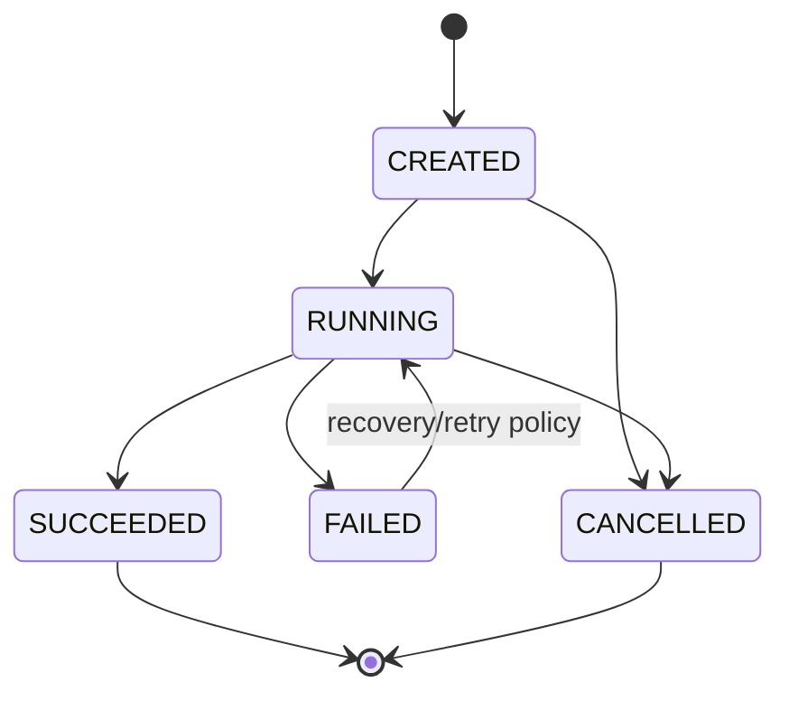
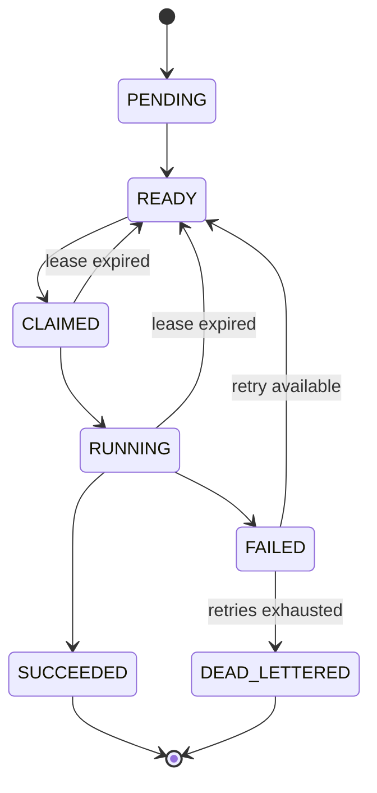

# Workflow and Task State Machine

## Workflow states

Valid triggers include successful validation and start, completion of all tasks, permanent workflow failure, explicit cancellation, and recovery after restart according to durable state.

## Task states

## Rules

PENDING means dependencies are not satisfied. READY means all dependencies are terminal-success and the task is eligible. CLAIMED records ownership before execution. RUNNING indicates execution has started. SUCCEEDED and DEAD_LETTERED are terminal.

Invalid transitions include READY directly to SUCCEEDED without a valid owner result, SUCCEEDED back to READY, and a stale worker moving a task after its fencing token has expired.

## Recovery

After restart, the orchestrator reads durable state. Expired CLAIMED or RUNNING tasks return to READY when policy permits. A completed task remains terminal and is not rerun.

A task result is accepted only when the submitted owner and fencing token still match current ownership. A stale result is rejected and recorded for diagnosis.
