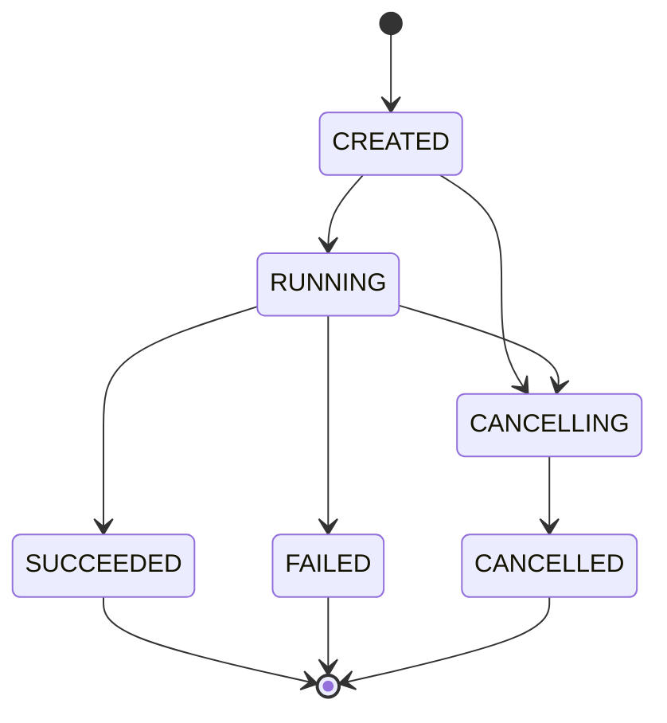
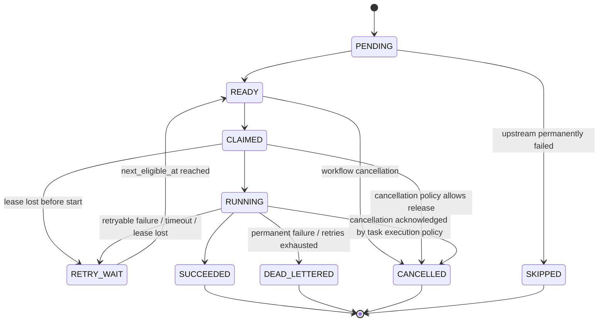

# Workflow and Task State Machine

## 1. State-machine principles

State transitions are driven by durable facts and explicit triggers. An execution attempt outcome is recorded separately from the task's resting state.

The task state machine therefore does not use `FAILED` as a temporary decision state. `FAILED`, `TIMED_OUT`, and `LEASE_LOST` are attempt outcomes. The task instance moves to `RETRY_WAIT` or `DEAD_LETTERED` after retry-policy evaluation.

The workflow lifecycle is separate from task retry handling. A workflow remains `RUNNING` while retryable tasks are waiting for their next eligible time.

## 2. Required workflow states



### Meaning

- `CREATED`: workflow instance exists and references an immutable validated definition version. Execution has not started.
- `RUNNING`: execution is active. Some tasks may be pending, ready, claimed, running, or waiting for retry.
- `CANCELLING`: cancellation was accepted, but tasks may still be executing or completing. The engine is converging the instance toward cancellation.
- `SUCCEEDED`: every required task completed successfully.
- `FAILED`: a required task reached `DEAD_LETTERED` or another defined permanent workflow failure.
- `CANCELLED`: cancellation has completed and no task remains allowed to perform work.

### Workflow transitions

| From | To | Trigger | Notes |
|---|---|---|---|
| CREATED | RUNNING | validated start | instance becomes executable |
| CREATED | CANCELLING | cancellation request | no new work should start |
| RUNNING | SUCCEEDED | all required tasks are SUCCEEDED | terminal |
| RUNNING | FAILED | required task becomes DEAD_LETTERED or permanent workflow failure | terminal |
| RUNNING | CANCELLING | accepted cancellation request | stop creating new work |
| CANCELLING | CANCELLED | all owned/retryable work is resolved according to cancellation policy | terminal |

Cancellation policy defines how a task currently executing is handled. The state machine does not pretend an in-flight external operation stops instantly.

## 3. Required task states



### Meaning

- `PENDING`: one or more dependency conditions are not yet satisfied.
- `READY`: all required predecessors satisfy the dependency-success rule and the task is eligible for claiming.
- `CLAIMED`: a worker session owns the task through a valid lease, but the execution-start acknowledgement has not yet been accepted.
- `RUNNING`: execution has started for the current attempt.
- `RETRY_WAIT`: the current attempt failed, timed out, or lost ownership, and another attempt is allowed after backoff.
- `SUCCEEDED`: the current attempt submitted a valid success result and the engine committed it.
- `DEAD_LETTERED`: the task cannot be retried because the failure is permanent or the retry policy is exhausted.
- `CANCELLED`: the task will not perform further work because the workflow cancellation policy ended it.
- `SKIPPED`: the task cannot execute because a required upstream dependency permanently failed.

## 4. Attempt outcomes

Each execution attempt gets a durable `task_attempt` record. Its outcome is one of:

```text
SUCCEEDED
FAILED
TIMED_OUT
LEASE_LOST
```

An attempt outcome does not itself determine the next task state. Retry-policy evaluation decides whether the task enters `RETRY_WAIT` or `DEAD_LETTERED`.

Correct failure flow:

```text
RUNNING
   |
   v
attempt recorded as FAILED / TIMED_OUT / LEASE_LOST
   |
   v
retry-policy evaluation
   |-----------------------------|
 retryable                       permanent/exhausted
   |                              |
   v                              v
RETRY_WAIT                  DEAD_LETTERED
   |
 backoff elapsed
   |
   v
 READY
```

This ensures every retryable failure records an attempt and passes through configured backoff.

## 5. Claim acknowledgement ambiguity

`CLAIMED -> RUNNING` requires an accepted execution-start acknowledgement or an equivalent durable engine event.

If the worker crashes, disappears, or stops renewing the lease before the acknowledgement arrives, the engine cannot assume execution never started. After lease expiry, the engine records `LEASE_LOST` for the attempt and sends the task through retry-policy evaluation.

The task does not jump directly to `READY` because doing so would bypass attempt history and backoff.

## 6. Valid task transitions

| From | To | Trigger |
|---|---|---|
| PENDING | READY | dependency evaluation confirms prerequisites succeeded |
| READY | CLAIMED | one worker session wins an atomic claim |
| CLAIMED | RUNNING | execution-start acknowledgement is accepted |
| CLAIMED | RETRY_WAIT | lease expires before start acknowledgement, attempt recorded LEASE_LOST |
| RUNNING | SUCCEEDED | current owner submits valid success result |
| RUNNING | RETRY_WAIT | retryable failure, timeout, or lease loss is recorded and policy allows retry |
| RUNNING | DEAD_LETTERED | permanent failure or retry exhaustion |
| RETRY_WAIT | READY | `next_eligible_at` reached |
| PENDING | SKIPPED | required upstream dependency becomes permanently failed |
| READY | CANCELLED | workflow enters cancellation and task has not started |
| CLAIMED | CANCELLED | cancellation policy permits release of ownership |
| RUNNING | CANCELLED | task execution policy acknowledges cancellation |

## 7. Invalid transitions

The following are rejected:

```text
READY -> SUCCEEDED
READY -> RUNNING
SUCCEEDED -> READY
SUCCEEDED -> RUNNING
DEAD_LETTERED -> READY
SKIPPED -> READY
CANCELLED -> READY
RUNNING -> READY without attempt recording and retry-policy evaluation
LEASE_LOST -> READY without retry-policy evaluation
worker without current ownership -> RUNNING
stale worker -> any ownership-sensitive result transition
```

## 8. Result-acceptance rule

Result acceptance is one atomic database check over:

```text
task_instance_id
worker_id
worker_session_id
lease_id
fencing_generation
current_task_state
lease validity
```

Only when all required ownership conditions match may a result transition the task.

A fencing generation mismatch, invalid session, expired lease, wrong lease ID, wrong task state, or stale worker causes rejection.

## 9. Ownership and fencing example

```text
Worker session S1 claims task T
    fencing generation = 7

Lease expires

Worker session S2 claims task T
    fencing generation = 8

S1 submits result with generation 7
    -> reject as stale
```

The authoritative fencing generation is stored on the task instance. Historical lease records retain the previous ownership generations.

## 10. Recovery rules

After orchestrator restart or normal recovery:

```text
READY -> remains READY
RETRY_WAIT -> remains RETRY_WAIT until eligible
CLAIMED + unexpired lease -> remains owned
CLAIMED + expired lease -> record LEASE_LOST, then retry-policy evaluation
RUNNING + unexpired lease -> remains owned
RUNNING + expired lease -> record LEASE_LOST, then retry-policy evaluation
SUCCEEDED -> remains SUCCEEDED
DEAD_LETTERED -> remains DEAD_LETTERED
SKIPPED -> remains SKIPPED
CANCELLED -> remains CANCELLED
```

Recovery must not steal work protected by an unexpired lease.

Multiple recovery schedulers may inspect the same expired task, but only one conditional database transition may win. A losing scheduler performs no second state transition.

## 11. Retry semantics

Retry policy belongs to the task definition's immutable policy version.

```text
attempt fails
     |
     v
record attempt outcome
     |
     v
retry-policy evaluation
     |
     +---- retry allowed ----> RETRY_WAIT ----> READY
     |
     +---- exhausted/permanent -> DEAD_LETTERED
```

`next_eligible_at` stores the end of the configured backoff.

A task marked `DEAD_LETTERED` causes the workflow to fail when the task is required for successful completion.

A task marked `SKIPPED` because an upstream required dependency permanently failed also prevents successful workflow completion.

## 12. DAG rules

A workflow definition must be validated before execution:

- every dependency references a task in the same definition
- duplicate task keys are rejected
- self-dependencies are rejected
- cycles are rejected

A task instance enters `READY` only when all required predecessors satisfy the dependency-success rule.

A workflow enters `SUCCEEDED` only when all required task instances are `SUCCEEDED`.
